<section  align="center">
  
</section>

# **Lister**

Mobile app for management and sharing tasks.

## Features
- Create new account.
- Login with existing account.
- Change password if you forgot your password.
- Add, change, and delete your tasks.
- Share your task to another users.
- Modify the sharing access.

## Screenshoots

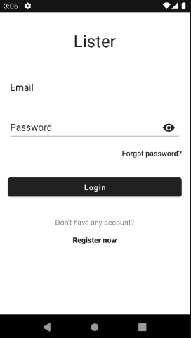
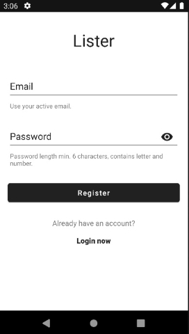

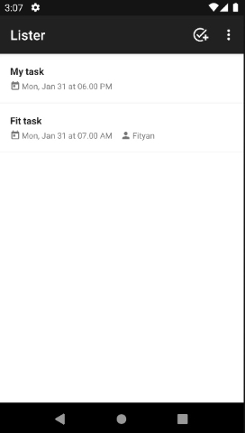
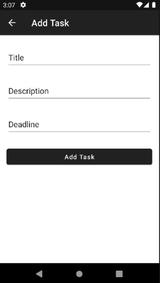
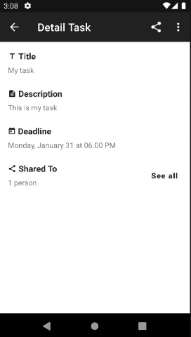
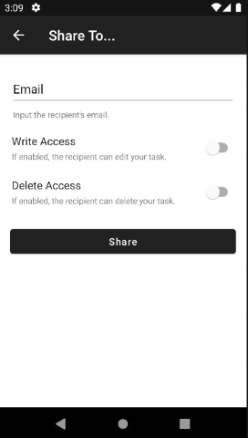
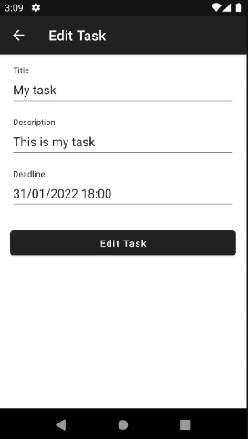
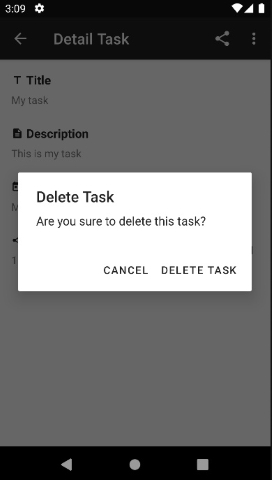
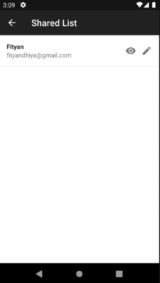
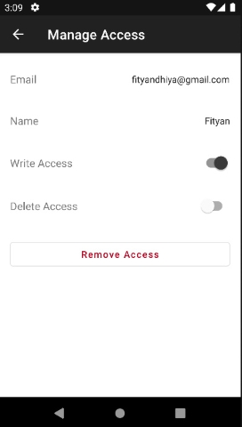

## Entity Relationship Diagram

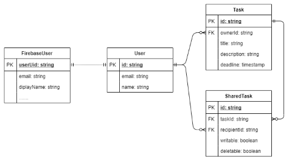
