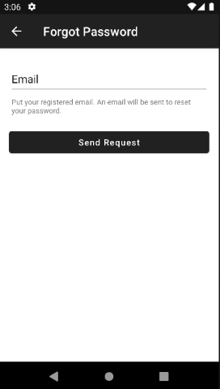

  

# **Lister**

Mobile app for management and sharing tasks.

This app is developed with programming language **Java** and using [**Firebase**](https://firebase.google.com/docs/android/setup#java) for data storage and authentication method.

## Features
- Create new account.
- Login with existing account.
- Change password if you forgot your password.
- Add, change, and delete your tasks.
- Share your task to another users.
- Modify the sharing access.

## Screenshoots

## Entity Relationship Diagram

## Contribution

Everybody can contribute to this project.

You may need to add this project to your own [Firebase project](https://firebase.google.com/docs/android/setup#create-firebase-project). You also need to [configure the Firestore](https://firebase.google.com/docs/firestore/quickstart#java) and creating new collections for `User`, `Task`, and `SharedTask` as shown in [ERD](README.md#entity-relationship-diagram).

After that, you need to [configure the Fireauth](https://firebase.google.com/docs/auth/android/password-auth#before_you_begin) in order to enable email-password based authentication.

## Disclaimer

This project was originally created for college assignment by me (**@fityannugroho**) and **@arisandyk**. This project is open-source and can be used for educational purposes.
